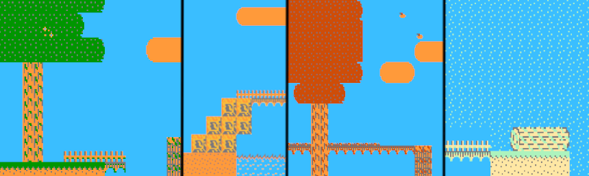

# 4 Seasons Away

A platformer for the NES about finding a friend.

Because the game is incomplete, please note:
1. You cannot go left. Implementing the 2 functions required would take me too much time. But the code is built around the idea that one day if I implement it I can easily go left without modifying too much other stuff.
2. There are no scrolling stoppers, so the screen will scroll past where it should be able to if this game were finished. This is because there is no player to go through doors with anyway!
3. There is a visual glitch when transitioning between areas. This is because there is no level transitions. If there were, it would not occur.
4. There is no player or enemies. This game is incomplete as mentioned before.

Built using the ASM6 compiler.

## "I just want to run the code"
1. Run `build.bash` or `./buildLinux` (double click in file explorer or run in terminal, I don't care)
2. Ensure it created a file `code.nes`
3. Run an NES emulator such as the provided `nester.exe` and select Open ROM and select the `code.nes`
4. Play!

## Editing/Running
**To edit the code**: Edit the `.asm` files in the main folder. `code.asm` is the main file which includes other files in the folder.

**To edit the tileset**: A program such as yychr is required. Use it to edit `tiles.chr`.

**To build**: Run `build.bash` or `./buildLinux` depending on your OS.

**To run**: Run `code.nes` using an NES emulator (after building). `nester.exe` is provided, but for debugging another such as [FCEUX](https://fceux.com/web/download.html) is recommended.

### Tilemaps
You will notice a tilemap folder. In it contains;
- `tilemap.asm`; the generated asm file. This contains the data the game will use when compiling, and is auto generated.
- `tilemap.dat`; the original tilemap data in a form that is easy to see and use
- `tilemap.py`; the conversion script to convert the `tilemap.dat` into the `tilemap.asm`
- `tilemap.md`; helpful documentation on how the original and converted forms of the tilemap data look like

To edit the tilemap;
1. Read up in `tilemap.md` about the format required, *only need to know about the `.dat` format though*
2. Write tilemap data in `tilemap.dat`
3. Convert it by running the `tilemap.py`. This will work without any external libraries.
4. Compile and run the main code (see above)

## Opcodes
A very nice list of opcodes for the NES' hardware can be found [here](https://wiki.preterhuman.net/NES_Programming_Guide), and the instructions for the specific ASM6 assembler can be found [here](./Instructs.txt).

