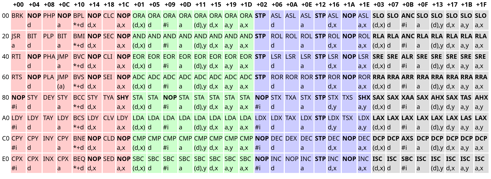

# 4 Seasons Away
A platformer for the NES about finding a friend.

## Editing
**To edit the code**: Edit the `code.asm` file.

**To edit the tiles**: A program such as yychr is required. Use it to edit `tiles.chr`.

**To build**: Run `build.bash` or `./buildLinux` depending on your OS.

**To run**: Run `code.nes` using an NES emulator (after building). `nester.exe` is provided, but for debugging another such as [FCEUX](https://fceux.com/web/download.html) is recommended.

## Opcode table

```
types:
a   - absolute address (2 bytes)
#i  - immediate value (1 byte)
d   - zero page address (1 byte)
*+d - relative address (1 byte)
y   - the y register (0 bytes, as it's implied)
x   - the x register (0 bytes, as it's implied)

syntax:
($a)  - absolute address at $a (dereference)
$l,$r - add $l and $r
```
